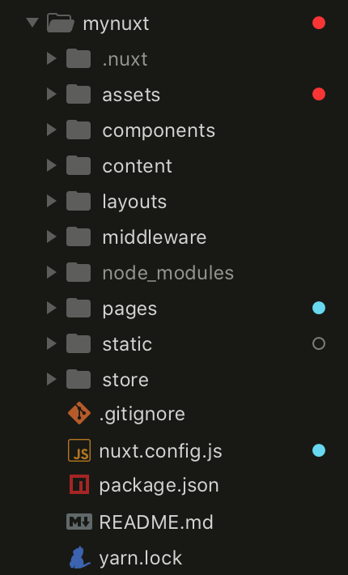

# NuxtJS

### Installation



```text
yarn create nuxt-app <project-name>
```



```
npm init nuxt-app <project-name>
```



```
npx create-nuxt-app <project-name>
```



It will ask you some questions \(name, Nuxt options, UI framework, TypeScript, linter, testing framework, etc.\), when answered, it will install all the dependencies. The next step is to navigate to the project folder and launch it:



```text
cd <project-name>
yarn dev
```



```
cd <project-name>
npm run dev
```



The application is now running on [http://localhost:3000](http://localhost:3000/). Well done!

### SEO HTML



```text
<template>
  <div class="container">
    <h1>Home page 🚀</h1>
    <NuxtLink to="/about">
      About page
    </NuxtLink>
  </div>
</template>

<script>
export default {
  head: {
    title: 'Home page 🚀',
    meta: [
      { hid: 'description', name: 'description', content: 'Home page description' }
    ],
    noscript: [
      { innerHTML: 'Body No Scripts', body: true }
    ],
    script: [
      { src: '/head.js' },
      // Supported since 1.0
      { src: '/body.js', body: true },
      { src: '/defer.js', defer: '' }
    ]
  }
}
</script>

<style>
.container {
  text-align: center;
  margin-top: 150px;
  font-size: 20px;
}
</style>
```



### Basic Structure




