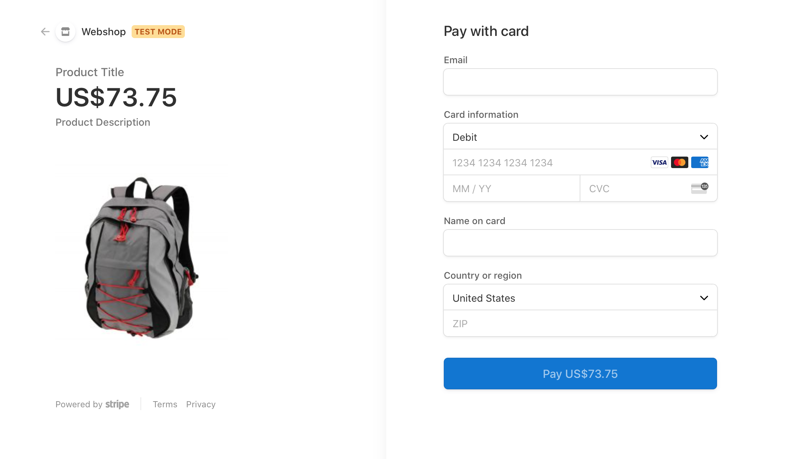

# Stripe V3

### Stripe version 3 implemetation for Laravel

At first we need two things from stripe

1. Publish key
2. Secret key

Add these keys to your .env file

```php
STRIPE_KEY=pk_test_1SuopxxxxkG6xxxxxxrHiuQAu94
STRIPE_SECRET=sk_test_Lrww1Ixxxxxxxxxxxxxxx
```

Now first go to your controller function and add as following

```php
public function payment()
{
    Stripe::setApiKey(env('STRIPE_SECRET'));
    $session = \Stripe\Checkout\Session::create([
        'payment_method_types' => ['card'],
        'line_items'           => [
            [
                'price_data' => [
                    'currency'     => 'usd',
                    'unit_amount'  => 7375,
                    'product_data' => [
                        'name'        => 'Product title',
                        'description' => 'Product description',
                        'images'      => ['https://example.com/uploads/2020/01/logo-large.png'],
                    ],
                ],
                'quantity'   => 1,
            ],
        ],
        'locale'               => 'en',
        'livemode'             => false,
        'mode'                 => 'payment',
        'success_url'          => route('payment.success'),
        'cancel_url'           => route('paymeny.cancel'),
    ]);

    return view('payment', ['session_id' => $session->id]);
}
```


Here I pass the **session\_id** to the **view\(payment.blade.php\)**.


Then in your payment blade file add 

```php
<div>
    <script src="https://js.stripe.com/v3"></script>
    <button id="checkout-button" class="btn btn-darker btn-block">Pay with Stripe</button>
</div>

<script>
        let stripe = Stripe('{{env('STRIPE_KEY')}}');

        let checkoutButton = document.getElementById('checkout-button');

        checkoutButton.addEventListener('click', function() {
            stripe.redirectToCheckout({
                sessionId: '{{$session_id}}'
            }).then(function (result) {
                alert(result.error.message);
            });
        });
    </script>
```

When you click the button pay with stripe you will see a similar page



You can also see the [developer documentation](https://stripe.com/docs/api) for more information.

